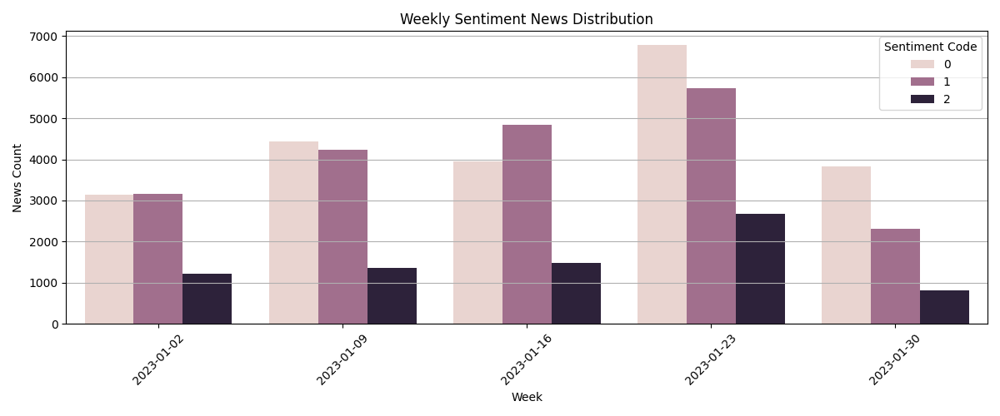
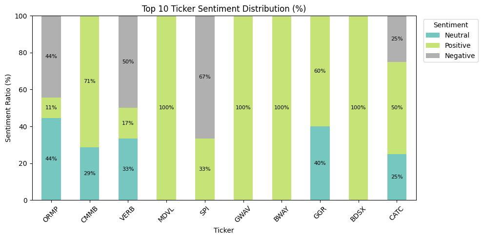
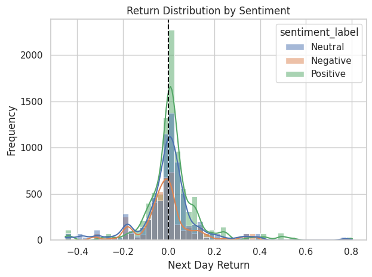
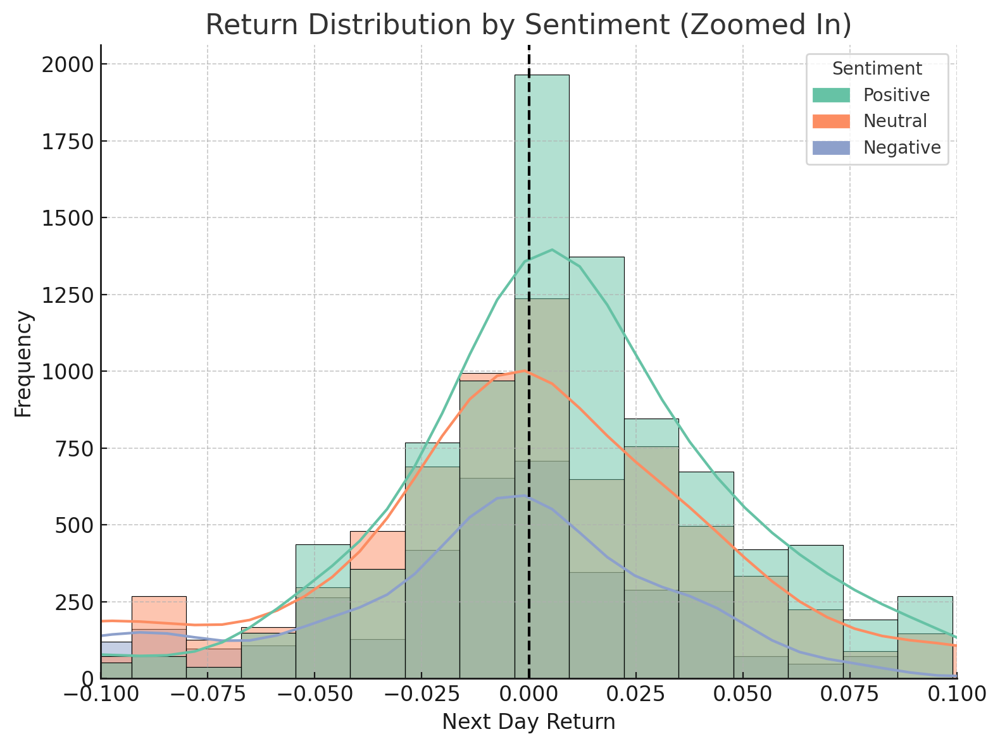
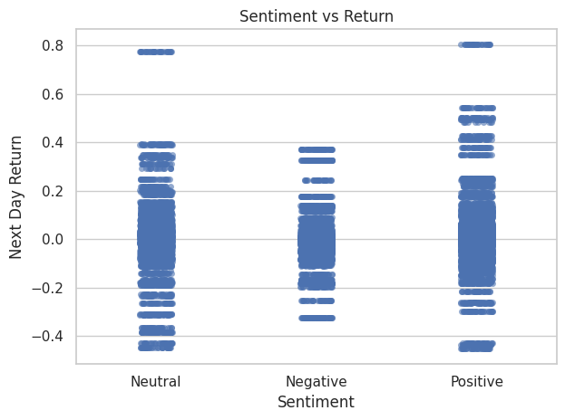
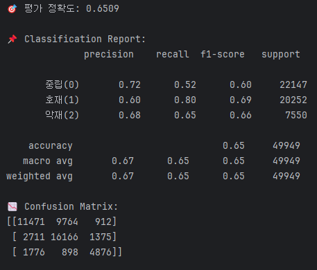

# 📈 NASDAQ 뉴스 기반 감성 분석 및 주가 반응 예측 프로젝트

---

## 1. 개요

## 1-1. 프로젝트 개요

- 목적: 투자자 입장에서 유의미한 뉴스 감성을 자동 분류하고, 이를 통해 단기 주가 예측 가능성 탐색
- 방법: 감성 분류 모델 학습(MobileBERT), 성능 비교 및 시각화 분석
- 데이터: NASDAQ 상장 종목 뉴스 + 종가/시가 기반 수익률 [데이터 출처](https://dacon.io/competitions/official/236145/data)

## 1-2. 분석 목표

- 감성 분류 정확도 향상
- 감성 라벨과 수익률 방향성 간 상관관계 파악
- 종목별 뉴스 감성 편향 탐색

## 1-3. 실무 활용 가능성

- 뉴스 기반 실시간 감성 알림 시스템 구축 가능
- 특정 종목/섹터 뉴스 감성 집중도 분석 활용
---
## 2. 데이터 설명

### 2.1 원시 뉴스 데이터 [데이터 출처](https://dacon.io/competitions/official/236145/data)

본 프로젝트에 사용된 원시 뉴스 데이터는 NASDAQ 상장 종목 관련 기사로부터 수집된 RSS 정보를 기반으로 하며, 주요 컬럼은 다음과 같다:

| Column             | 설명                                           |
|--------------------|------------------------------------------------|
| `rgs_dt`           | 뉴스 게시일 (YYYYMMDD)                         |
| `tck_iem_cd`       | 종목 코드 (NASDAQ 티커)                        |
| `til_ifo`          | 뉴스 제목                                      |
| `ctgy_cfc_ifo`     | 뉴스 카테고리 (예: Stocks, Investing 등)       |
| `mdi_ifo`          | 뉴스 출처 미디어 정보 (예: Zacks, Fintel 등)   |
| `news_smy_ifo`     | 뉴스 요약문 (→ 감성 분석 대상 텍스트)          |
| `rld_ose_iem_tck_cd`| 뉴스 본문에서 언급된 종목들 (중복 가능)        |
| `url_ifo`          | 뉴스 원문 링크                                 |

> 이 중 감성 분석을 위해 `rgs_dt`, `tck_iem_cd`, `news_smy_ifo` 컬럼을 활용하였으며, 이후 감성 라벨링을 작성했다.

---

### 2.2 감성 라벨링 방식

#### 🔹 라벨링 전략

1. **키워드 기반 자동 라벨링**  
   - 긍정 키워드 예시: `'record'`, `'growth'`, `'beat'`, `'surge'`, `'rebound'` 등  
   - 부정 키워드 예시: `'fall'`, `'drop'`, `'miss'`, `'layoff'`, `'plunge'` 등  
   - 뉴스 요약문(`news_smy_ifo`) 내 키워드 포함 여부에 따라 라벨 부여

🔹 수작업 직접 라벨링 (핵심 전략)

이번 프로젝트에서 가장 많은 시간을 들인 부분 중 하나는 **뉴스 기사 약 4,000건에 대해 직접 감성 라벨을 부여한 작업이다.

- 키워드만으로 감정을 판단하는 방식의 한계를 느껴, 기사 내용을 **실제 투자자 입장에서 해석**하려고 노력했다.
- 예를 들어 `'Apple shares dip despite record revenue'`처럼 키워드는 긍정이지만, 문맥상으로는 주가 하락과 연결되기 때문에 중립이나 악재로 판단했다.

감성을 판단할 때는 다음과 같은 기준을 세우고 최대한 일관성 있게 적용했다:

| 판단 기준     | 설명                                                   |
|----------------|--------------------------------------------------------|
| 수익성 강조     | 실적 호조, 수익 증가, 매출 성장 등은 Positive (단, 주가 반영 여부 고려) |
| 경영 리스크     | CEO 교체, 소송, 구조조정 등은 Negative                  |
| 정보 전달 위주   | 단순 리포트/전망 기사 등은 Neutral                     |
| 혼합 표현       | 긍정/부정이 섞인 경우 **더 중요한 감정**에 따라 판단         |

- 전체 라벨링은 먼저 **1차 개별 판단**을 진행한 후,
- 해석이 모호한 문장은 따로 표시해두고, 이후 **반복 검토하거나 조원과 논의해 결정했다.

> 총 4,000건 이상의 기사 요약문을 직접 읽고 분류하면서, 단순히 정확도를 높이기보다는  
> **실제로 투자에 참고할 수 있을 만한 감성 분류 기준을 만드는 데 중점을 뒀다.**

#### 🔹 감성 라벨 매핑

| sentiment (int) | sentiment_label (str) |
|------------------|------------------------|
| 0                | Neutral                |
| 1                | Positive (호재)        |
| 2                | Negative (악재)        |

---

### 2.3 감성 라벨링 결과 예시

감성 라벨링이 완료된 뉴스 데이터는 다음과 같은 형태로 정리했다:

| date       | ticker | content                                | sentiment | sentiment_label |
|------------|--------|----------------------------------------|-----------|------------------|
| 2023-01-02 | AAPL   | Apple posts record revenue in Q4 2022  | 1         | Positive         |
| 2023-01-02 | TSLA   | Tesla stock falls despite strong sales | 2         | Negative         |

---

### 2.4 주가 데이터

해당 뉴스가 발표된 시점과 그 이후의 주가 반응을 비교하기 위해, 아래와 같은 주가 데이터를 함께 사용했다:

| Column           | 설명               |
|------------------|--------------------|
| `trd_dt`         | 거래일 (YYYYMMDD)  |
| `tck_iem_cd`     | 종목 코드          |
| `gts_iem_ong_pr` | 시가 (Open Price)  |
| `gts_iem_end_pr` | 종가 (Close Price) |

---

## 3. 라벨링 전략 비교

### 3.1 키워드 기반 자동 라벨링

* `positive_keywords`, `negative_keywords` 리스트에 기반하여 뉴스 내 포함 여부로 레이블 부여
* 장점: 대량처리에 유리하고 속도 빠름
* 단점: 문맥 고려 어려움 → 과적합 경향

### 3.2 수작업 직접 라벨링

* 뉴스 본문을 직접 읽고 투자자 관점에서 의미를 분석하여 감성을 분류
* 장점: 문맥과 실제 투자 영향 고려 가능
* 단점: 시간이 많이 들며 주관성 개입 여지 있음

---

## 4. 모델 학습 및 실험 구조

### 4.1 모델 구조

* MobileBERT (HuggingFace Transformers 기반)
* 입력: 뉴스 본문 (최대 256 토큰)
* 출력: 감성 분류 (중립/호재/악재)

### 4.2 학습 조건 비교

| 조건   | 라벨링 방식     | 중복 처리 | 평가 정확도                  |
| ---- | ---------- | ----- |-------------------------|
| 실험 A | 키워드 기반     | 중복 허용 | **0.8686** (과적합 의심)     |
| 실험 B | 수작업 직접 라벨링 | 중복 제거 | **0.6521** (일반화 정확도 반영) |

---

## 5. 시각적 분석 결과

### 5.1 날짜별 감성 흐름

> 말일에 긍정 뉴스 증가, 중립 뉴스가 전체적으로 가장 많은 경향

### 5.2 종목별 감성 비율

> SPI 등 일부 종목은 뉴스 감성이 한쪽으로 쏠리는 현상 존재

### 5.3 감성별 수익률 분포

> 긍정 뉴스는 수익률이 양(+)으로 이동하는 경향, 악재는 음(-) 방향으로 치우침

### 5.4 감성 vs 수익률 산점도

> 모든 감정에서 수익률이 0% 부근에 몰려 있음

> 이는 단기적으로 뉴스 감성만으로 주가가 급등·급락하는 경우는 드물다는 현실 반영

### 5.5 감성 분류 모델 성능

> 키워드 기반 모델은 높은 정확도를 보이지만 문장 암기 현상 가능

> 수작업 라벨 기반 모델은 중립 뉴스에서 다소 혼동을 보이지만, 호재는 높은 재현율(0.80) 로 잘 감지되며, 전반적 정확도는 65% 수준으로 현실적 분류 성능을 보여준다.

---

## 7. 종합 결론

* 직접 수작업 라벨링은 현실적 타당성이 높지만 정확도는 상대적으로 낮음 → 일반화 성능 반영
* 키워드 기반 자동 라벨링은 높은 정확도를 보이나, 문맥 반영이 어려움
* 수익률 예측에 직접 활용하려면 **라벨 품질 + 타이밍 고려** 중요
* 감성 정보만으로 수익률 예측은 제한적이며, 반응 시차, 종목 특성, 뉴스 출처 등의 요소를 함께 고려해야 함

---

## 🙋 작성자 및 사용 기술

* **Taehyun Kang**
* Python, PyTorch, HuggingFace, Transformers, Pandas, Seaborn, Matplotlib
