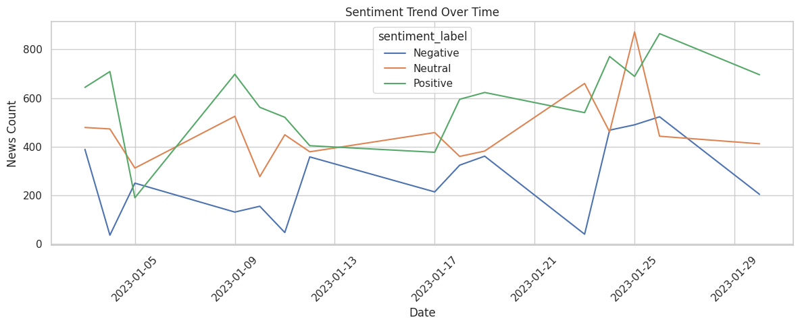
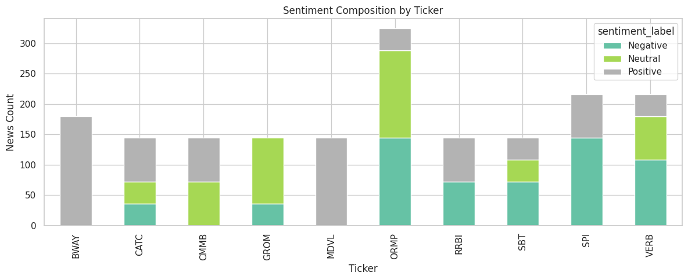

# 📈 NASDAQ 뉴스 기반 감성 분석 및 주가 반응 예측 프로젝트

---

## 1. 서론 및 연구 목적

최근 증권시장에서 뉴스 기반의 정성적 정보가 투자 판단에 중요한 요소로 작용함에 따라, 자연어 처리(NLP) 기반의 감성 분석을 활용한 주가 예측 모델이 각광받고 있습니다. 본 프로젝트는 NASDAQ 상장 종목들의 뉴스 요약문을 수집하여 키워드 기반 자동 라벨링과 직접 수작업으로 수행한 라벨링 방식의 감성 분석 모델을 비교 실험하였습니다. 특히, 라벨링 방식이 모델 성능과 실제 주가 반응에 미치는 영향을 실증적으로 분석하고자 하였으며, 감성과 단기 수익률 간의 상관성 및 반응 지연 현상 등을 포착하려 하였습니다.
---

## 2. 데이터 설명

### 2.1 뉴스 데이터 (감성 라벨링 포함)

| Column            | Description                        |
| ----------------- | ---------------------------------- |
| `date`            | 뉴스 게시일 (YYYY-MM-DD)                |
| `ticker`          | 종목 티커 (e.g. AAPL, NVDA)            |
| `content`         | 뉴스 요약 내용                           |
| `sentiment`       | 감성 코드 (0: 중립, 1: 호재, 2: 악재)        |
| `sentiment_label` | 감성명칭 (Neutral, Positive, Negative) |

### 2.2 주가 데이터

| Column           | Description       |
| ---------------- | ----------------- |
| `trd_dt`         | 거래일 (YYYYMMDD)    |
| `tck_iem_cd`     | 종목코드 (ticker와 동일) |
| `gts_iem_ong_pr` | 시가                |
| `gts_iem_end_pr` | 종가                |

---

## 3. 라벨링 전략 비교

### 3.1 키워드 기반 자동 라벨링

* `positive_keywords`, `negative_keywords` 리스트에 기반하여 뉴스 내 포함 여부로 레이블 부여
* 장점: 대량처리에 유리하고 속도 빠름
* 단점: 문맥 고려 어려움 → 과적합 경향

### 3.2 수작업 직접 라벨링

* 뉴스 본문을 직접 읽고 투자자 관점에서 의미를 분석하여 감성을 분류
* 장점: 문맥과 실제 투자 영향 고려 가능
* 단점: 시간이 많이 들며 주관성 개입 여지 있음

---

## 4. 모델 학습 및 실험 구조

### 4.1 모델 구조

* MobileBERT (HuggingFace Transformers 기반)
* 입력: 뉴스 본문 (최대 256 토큰)
* 출력: 감성 분류 (중립/호재/악재)

### 4.2 학습 조건 비교

| 조건   | 라벨링 방식     | 중복 처리 | 평가 정확도                  |
| ---- | ---------- | ----- |-------------------------|
| 실험 A | 키워드 기반     | 중복 허용 | **0.8686** (과적합 의심)     |
| 실험 B | 수작업 직접 라벨링 | 중복 제거 | **0.6521** (일반화 정확도 반영) |

---

## 5. 시각적 분석 결과

### 5.1 날짜별 감성 흐름

> 말일에 긍정 뉴스 증가, 중립 뉴스가 전체적으로 가장 많은 경향

### 5.2 종목별 감성 비율

> SPI 등 일부 종목은 뉴스 감성이 한쪽으로 쏠리는 현상 존재

### 5.3 감성별 수익률 분포

> 긍정 뉴스는 수익률이 양(+)으로 이동하는 경향, 악재는 음(-) 방향으로 치우침

### 5.4 감성 vs 수익률 산점도

> 감성과 수익률 사이에 약한 패턴이 존재하지만 상관성은 미약함

### 5.5 감성 분류 모델 성능

> 키워드 기반 모델은 높은 정확도를 보이지만 문장 암기 현상 가능

> 수작업 라벨 기반 모델은 중립 뉴스에서 다소 혼동을 보이지만, 호재는 높은 재현율(0.80) 로 잘 감지되며, 전반적 정확도는 65% 수준으로 현실적 분류 성능을 보여줍니다.

---

## 7. 종합 결론

* 직접 수작업 라벨링은 현실적 타당성이 높지만 정확도는 상대적으로 낮음 → 일반화 성능 반영
* 키워드 기반 자동 라벨링은 높은 정확도를 보이나, 문맥 반영이 어려움
* 수익률 예측에 직접 활용하려면 **라벨 품질 + 타이밍 고려** 중요
* 감성 정보만으로 수익률 예측은 제한적이며, 반응 시차, 종목 특성, 뉴스 출처 등의 요소를 함께 고려해야 함

---

## 🙋 작성자 및 사용 기술

* **Taehyun Kang**
* Python, PyTorch, HuggingFace, Transformers, Pandas, Seaborn, Matplotlib
